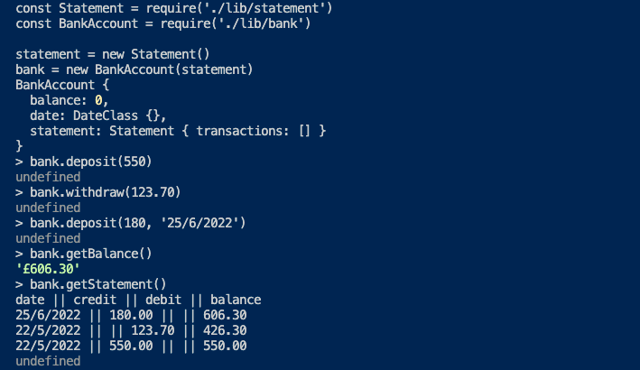

# Bank Tech Test

Entering my tenth week at Makers, I've been given multiple challenges set to sharpen and challenge my Object Oriented Design and Test Driven Development skills.

Bank Tech Test being the first of these. I found the process for this challenge very enjoyable, extracting every specification from the given 'acceptance criteria' for this task was an exercise in deduction. On my first submission's feedback I missed out decimilisation in the printed statement. I was also given some notes on the README and refactoring my original Bank and Account class into one BankAccount class to avoid duplication and to keep the code DRY.

For more information on the acceptance criteria for this task see './bank_tech_test.md'.

## Installation

- clone this repository to your local machine
- run `npm install`
- load 'nodetest.js' in node to set up a feature test
- test with `jest`

The programme allows you to deposit/withdraw from the bank class. For testing purposes you can enter a date in this format 'dd/mm/yyyy', as a second argument after the deposit/withdrawal amount. Otherwise the argument will default and call the date today.

## Usage

